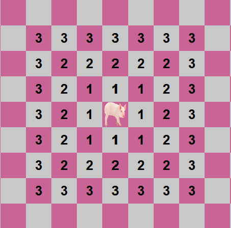

# Swinemeeper: A game about meeping the swine!
In swinemeeper, your goal is simple: meep (click) the swine in as fewest meeps as possible!\
Swinemeeper takes place on a 25x25 board of tiles, and only one of those tiles houses the swine.

## How to meep the swine:
Each time you click on a tile, you will **meep** it. If that tile has a swine, you win! Otherwise, the tile will become **meeped** and it will display a number corresponding to the distance of the shortest path from that point to the swine, with diagonal movement allowed.\
\
Here is an example of what distance would look like.\
\
So it's easy, right? You can simply triangulate the position of the swine and win in 3 clicks, no? Well, unfortunately, just like swines in real life, this swine does not want to be meeped. Each time you meep a tile, the swine may move to a random adjacent unmeeped tile. If it feels like it or if it has no valid moves, it will not move. This does mean the swine can be trapped, but that takes a lot of meeps.\
\
That's all! Happy meeping!